#  Dynamic Website with Terraform
Deploying a Dynamic Website on AWS with Terraform

In this repository, I am using terraform to create resources in aws

<h2>Project Architecture</h2>

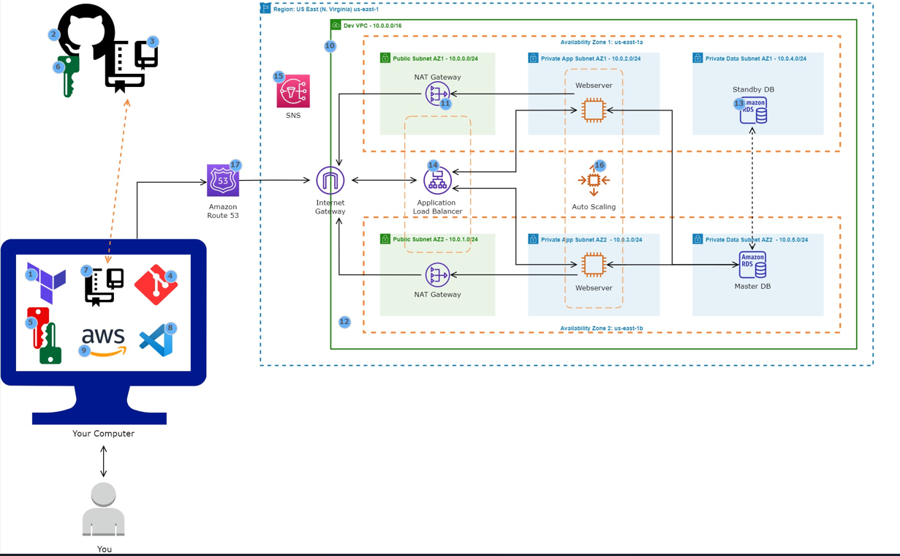

AUTHENTICATE WITH AWS

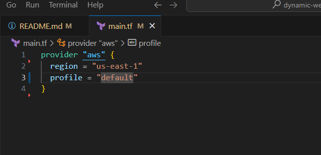

Store our statefile in the s3 bucket we created

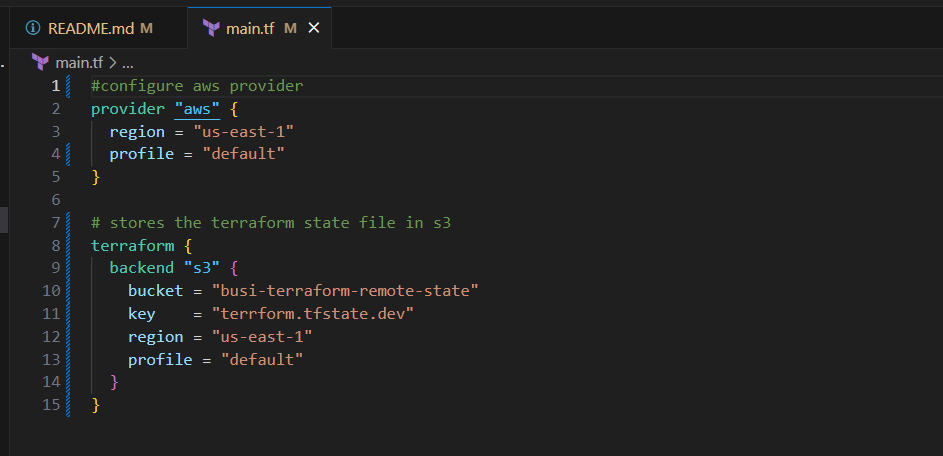

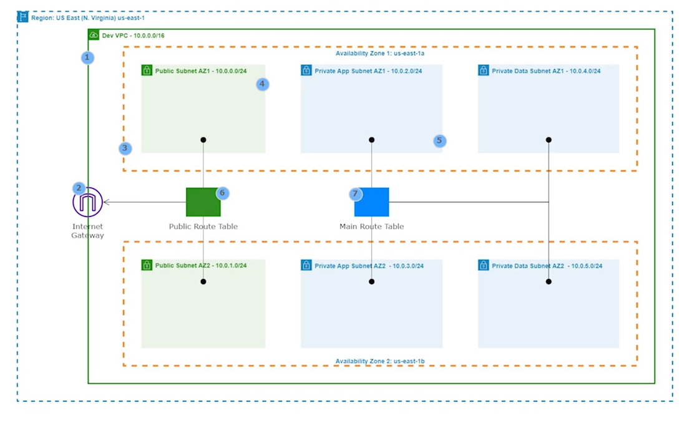

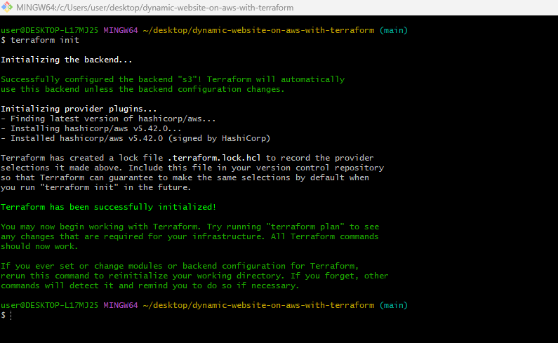

### Create a Nat Gateway

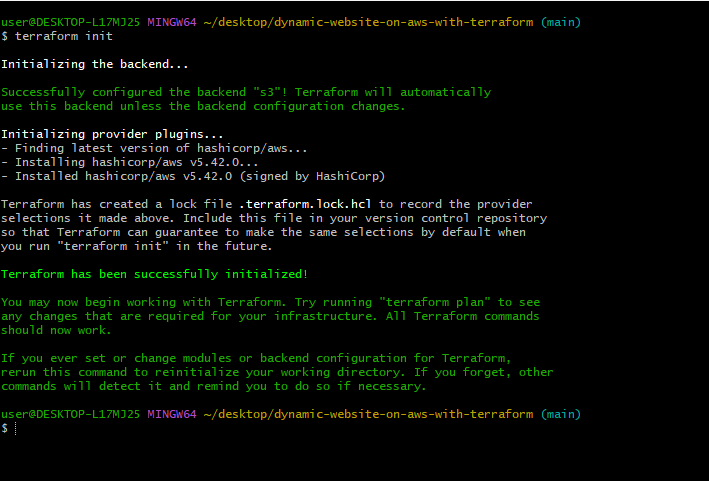

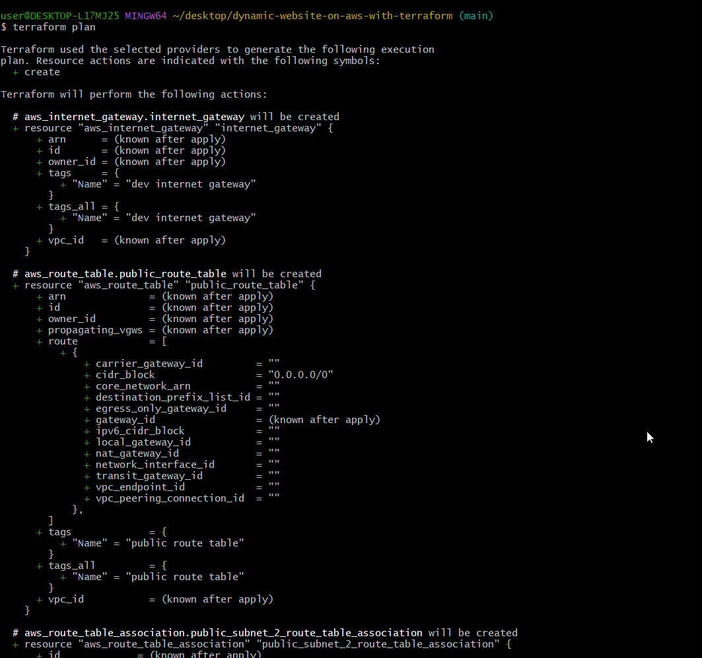

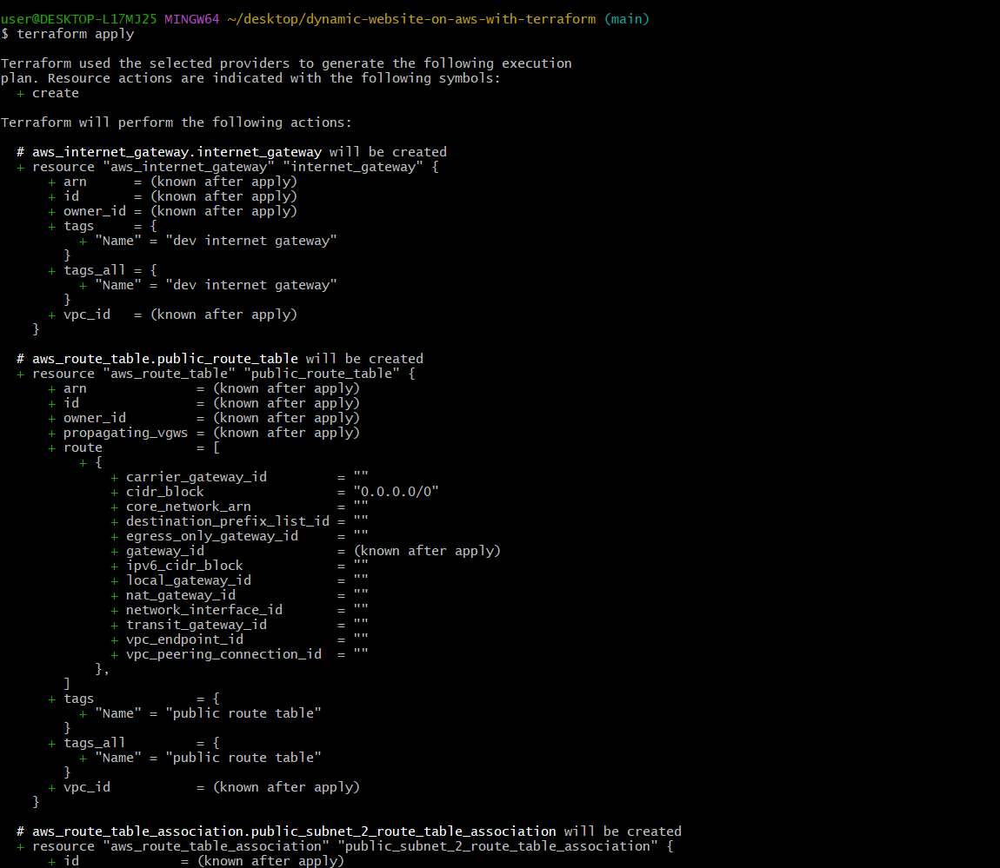

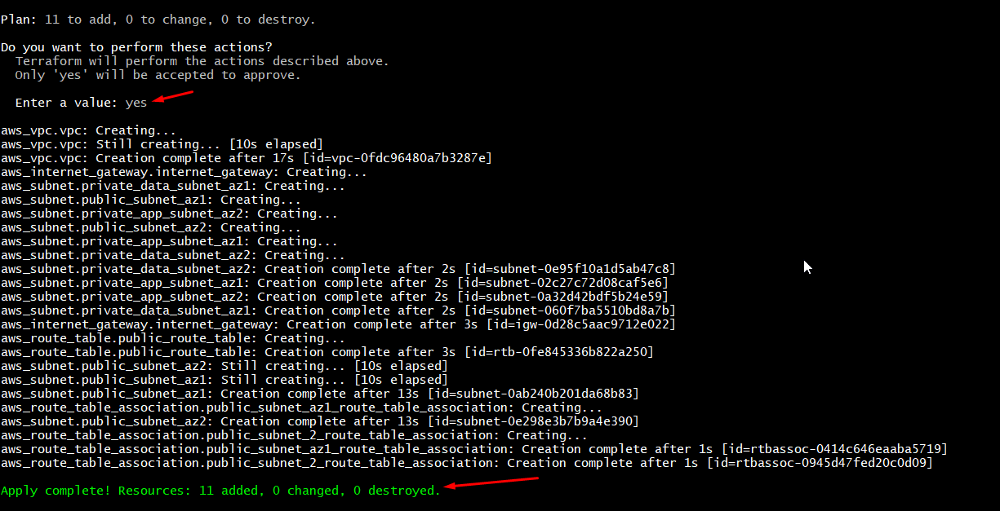

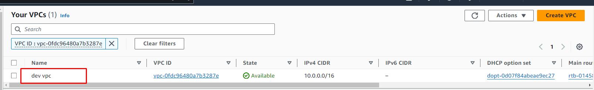

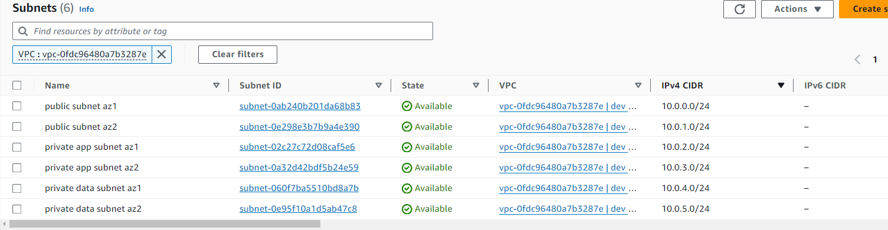

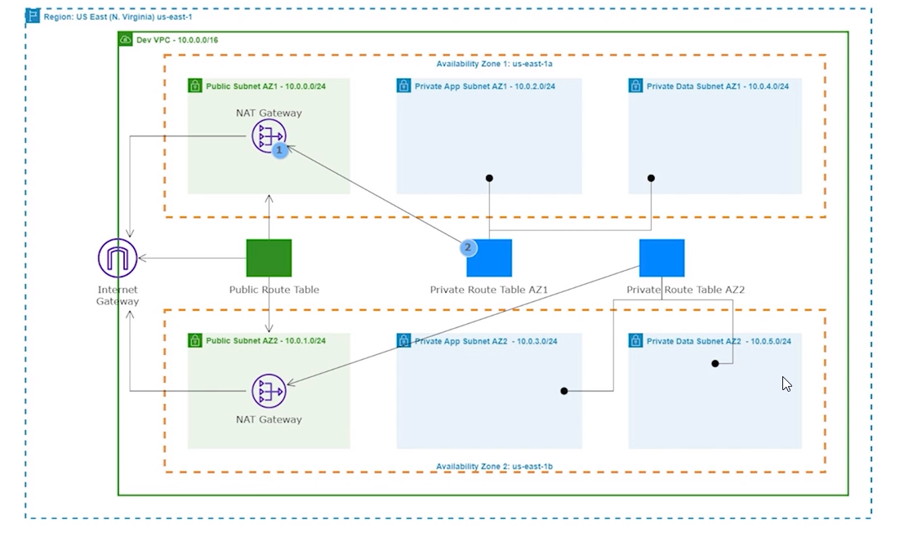

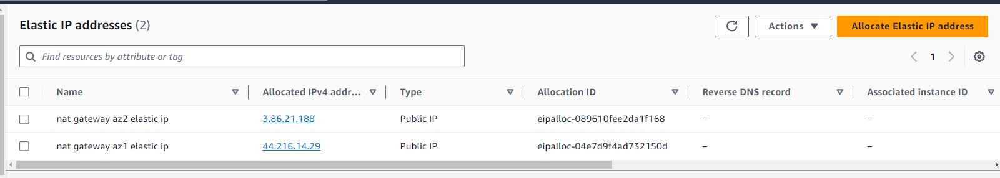

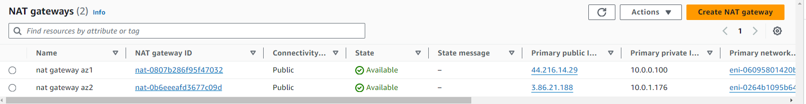

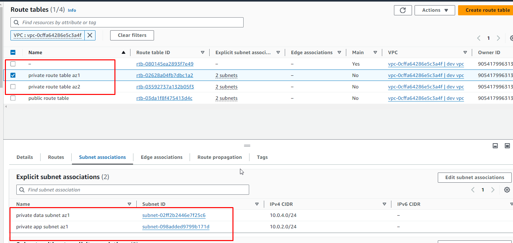

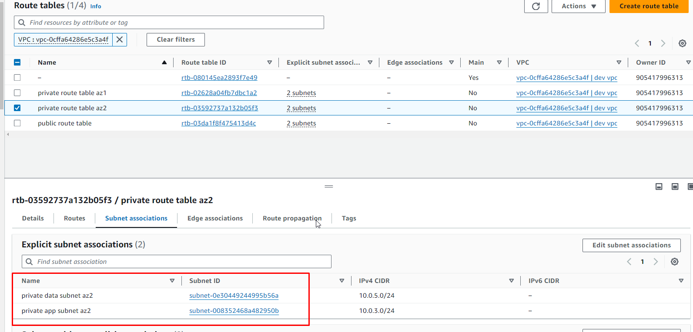

### Create Security Group

