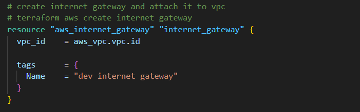
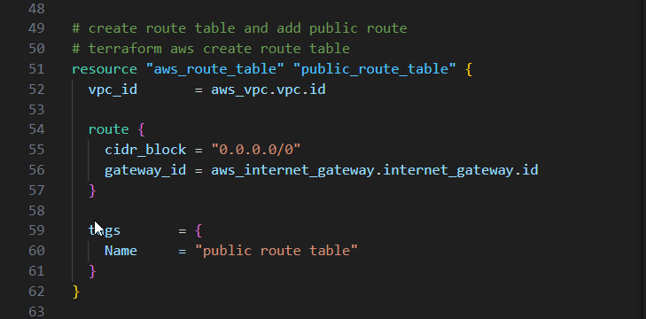

 

In this project, I am deploying a highly available, fault-tolerant 3-Tier Website on AWS using Terraform. The website will be hosted inside a Virtual Private Cloud, also known as a VPC. Within the VPC, we will create our Public and Private Subnets. Inside the Subnets, we will have our Nat Gateways in the Public Subnets, while EC2 instances and Databases will reside in the Private Subnets. Additionally, we will set up an Internet Gateway, SNS notifications, add Auto-Scaling, configure Route 53, and secure our website using Certificate Manager.


Before we dive into the project, there are some prerequisites. You need to have the following setup before starting:

- Install Terraform
- Sign up for a GitHub account
- Have Git installed
- Create Key Pairs
- Add your public SSH key to GitHub
- Have VSCode installed
- Install the AWS command line (CLI) on a windows computer.


Now, it's time for us to get our hands dirty, but first, let's understand what Terraform is.


Terraform is an Infrastructure as Code (IAC) tool primarily used by DevOps teams to automate various infrastructure tasks. Provisioning cloud resources, for instance, is one of the main use cases of Terraform.

Terraform allows you to describe your complete infrastructure in code form. Even if your servers come from different providers such as AWS or Azure, Terraform helps you build and manage these resources in parallel across providers. Terraform integrates seamlessly with CI/CD pipelines, allowing infrastructure changes to be automatically applied as part of the deployment process. This enables fast, repeatable, and automated deployments while maintaining infrastructure consistency.

## GitHub Repository Setup


Create a GitHub repository where you will store your project code. Make the repository public, but please note that in the real world, it would be private. Add a README and on the `.gitignore` drop-down menu enter Terraform.


Copy the link to your repository. This is the link you'll use to clone the repository to your local machine, enabling you to start writing code on it.


Open your command line, Powershell, or Windows CLI, and clone your repository. I have cloned the repository to my desktop, but you can clone it anywhere on your computer. Then, enter `code .` to open VSCode.


## S3 Bucket for Remote State

When you use Terraform to create resources in AWS, Terraform will record the information about the resources you created in a Terraform state file. The next time you go to update those resources, Terraform will use the state file to find those resources and update them accordingly.

We will store our Terraform state in an S3 bucket. This will ensure that our state is stored reliably.

In the **S3 management console, click create bucket**. Provide a unique name to your bucket, select the region for your S3 Bucket `us-east-1` and enable bucket versioning. Click create bucket.


Now that we have our S3 Bucket, to prevent multiple users from making changes to the state at the same time, we create a DynamoDB Table to lock the Terraform state.


## Creating AWS Resources with Terraform

First, configure an AWS Provider to establish a secure connection between Terraform and AWS. Specify the provider that you will be using (e.g., Azure, AWS, GCP), and specify the region in which you will build the resources. If you have a named profile, enter its name.


Create a file named `main.tf`, or you can create separate files for the backend and provider by executing the following commands:

```
touch provider.tf backend.tf

```

Then, store the state file in the S3 bucket, and lock it with the DynamoDB table that you created.

```
terraform {
  backend "s3" {
    bucket = "mybucket"
    key    = "path/to/my/key"
    region = "us-east-1"
  }
}

```


## Creating a 3-Tier VPC


The following architecture outlines the components included in our VPC:


-  VPC with public and private subnets distributed across 2 availability zones.
-  An Internet Gateway facilitates communication between instances in the VPC and the internet.
-  We are using 2 Availability Zones for high availability and fault tolerance.
-  Resources such as NAT gateway, Bastion Host, and Application Load Balancer use Public Subnets.
-  We will put the webservers and database servers in the Private Subnets to protect them.
-  The Public Route Table is associated with the public subnets and directs traffic to the internet via the internet gateway.
-  The Main Route Table is associated with the private subnets.


First, we will create a variables file. Think of a variable as a placeholder that you can use to store a value, and you can reference that value later on in your project. You will place all the variables for your project in this file.

Open VSCode, next open create a file named `variable.tf` then create the variables for the VPC. W are using the cidr block that is in our architecture diagram  `"10.0.0.0/16"`


Once you have created the variable for your VPC CIDR block, create a new file and name it `vpc.tf`. In the VPC file, we can reference this variable. To reference this CIDR block in your VPC file, type `var` then the variable name `vpc_cidr`. You will notice that if you only type var, the rest of the variable name, which is `vpc_cidr`, will populate.

```

# terraform aws create vpc
resource "aws_vpc" "vpc" {
  cidr_block              = var.vpc_cidr
  instance_tenancy        = "default"
  enable_dns_hostnames    = true

  tags      = {
    Name    = "dev vpc"
  }
}
```


Next, we'll define an **Internet Gateway** and attach it to the VPC we just created. 

To create the Internet Gateway, we specified the resource type as `"aws_internet_gateway"` and assigned the local resource name `"internet_gateway"`




The next resources we'll create are our public subnets, one in availability zone 1 and the other in availability zone 2, named `public_subnet_az1` and `public_subnet_az2` respectively.

Create the variables for the subnets in the `variables.tf` file and assign the the required values as per the architecture diagram. 


Create the subnet resources for the 2 subnets and call the variables created above. Use the `aws_subnet` resource type and refer to the variables you defined earlier.

In this configuration, we are referencing the VPC ID variable var.`vpc_id` and the CIDR block variables for each subnet `var.public_subnet_cidr_az1` and `var.public_subnet_cidr_az2`. Additionally, we specify the availability zones using the variables `var.availability_zone_1` and `var.availability_zone_2`.


The next resource we're going to create is our Route Table, and we will add routes to that route table.




Then, you will associate our public subnets in availability zones 1 and 2 with the route table you just created.


You will now create the rest of the subnets, all of which will be private. This includes 2 private app subnets for availability zones 1 and 2, as well as 2 private data subnets for availability zones 1 and 2.


These variables define the CIDR blocks for each of the private subnets in the respective availability zones. Adjust the CIDR blocks according to your specific requirements.


Now it's time to run the code for the VPC. Before you run your Terraform code, always ensure that you are in the directory where your code is located.

Type `terraform init` and press Enter to initialize Terraform.


Once Terraform has initialized, run `terraform plan`. This command will show you the plan of the resources that Terraform will create.


Once you are satisfied with the plan, run `terraform apply` to apply and create the resources as specified.


You will now see that Terraform has created the resources. To verify this, open your management console and search for VPC. You will see that Terraform created the VPC named `dev vpc`, and under subnets, you will see that all the subnets were created.


## Create a Nat Gateway

The NAT Gateway allows the instances in the private app subnets and private data subnets to access the internet.
The Private Route Table is associated with the private subnets and routes traffic to the internet through the NAT gateway.


To begin creating your NAT gateway, navigate to your project folder and create a file named `nat-gateway.tf`.

Before creating the NAT Gateway, allocate Elastic IPs for availability zone 1 and 2. These Elastic IPs will be used for the NAT Gateways in the public subnets az1 and az2.


You will create 2 NAT Gateways, one in the first availability zone and the other in the second availability zone. Therefore, you need to allocate 2 Elastic IP addresses. It should look like this:


Save your file and open a new terminal. Run `terraform plan` to verify the plan. If all the information is correct, run `terraform apply` to create the resources in our AWS account.


**The 2 elastic IP addresses**


**The 2 NAT gateways**


The **2 route tables** we created. For each route table there are **2 explicit subnet association**. If you select **Private route table az1** then click **Subnet associations** you can see that the 2 private subnets are associated with this route table.


After reviewing the resources that Terraform created in the management console and ensuring everything is correct, it's time to push the code to GitHub.

In the visual studio code, let’s push the new updates to our GitHub repository. Select *Source control > type your commit message > Click the check mark > Sync changes*.

## Create Security Group

To control access and mitigate potential security risks for our resources, we will create ingress (inbound) security groups.

Open your project folder and create a Terraform file for the security group. Name the file `security-group.tf`.

- Create a security group for our **Application Load Balancer (ALB)** and open `HTTP port 80 and HTTPS port 443`. Allow traffic from anywhere `(0.0.0.0/0)` as the source.

- Create a security group for SSH access, allowing traffic on `port 22` only from `your IP address`.

- Create a security group for the web servers, allowing inbound traffic on `ports 80 and 443` from the `ALB security group`, and on `port 22` from the `SSH security group`.


- Create a security group for the database servers, allowing inbound traffic on `port 3306` from the `web server security group`.


Create Application Load Balancer


### Create SNS Topic


### Create Auto Scaling Group


### Create an Amazon Machine Image (AMI)

Once we have installed and onfigure our website, we will use the EC2 instance we have installed our website on to create an AMI. Then we can use the AMI to launch new EC2 instances with our website already configured o them.


