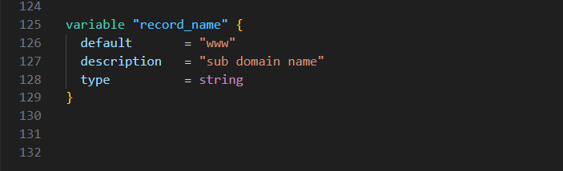

 

In this project, I am deploying a highly available, fault-tolerant 3-Tier Website on AWS using Terraform. The website will be hosted inside a Virtual Private Cloud, also known as a VPC. Within the VPC, we will create our Public and Private Subnets. Inside the Subnets, we will have our Nat Gateways in the Public Subnets, while EC2 instances and Databases will reside in the Private Subnets. Additionally, we will set up an Internet Gateway, SNS notifications, add Auto-Scaling, configure Route 53, and secure our website using Certificate Manager.


Before we dive into the project, there are some prerequisites. You need to have the following setup before starting:

- Install Terraform
- Sign up for a GitHub account
- Have Git installed
- Create Key Pairs
- Add your public SSH key to GitHub
- Have VSCode installed
- Install the AWS command line (CLI) on a windows computer.


Now, it's time for us to get our hands dirty, but first, let's understand what Terraform is.


Terraform is an Infrastructure as Code (IAC) tool primarily used by DevOps teams to automate various infrastructure tasks. Provisioning cloud resources, for instance, is one of the main use cases of Terraform.

Terraform allows you to describe your complete infrastructure in code form. Even if your servers come from different providers such as AWS or Azure, Terraform helps you build and manage these resources in parallel across providers. Terraform integrates seamlessly with CI/CD pipelines, allowing infrastructure changes to be automatically applied as part of the deployment process. This enables fast, repeatable, and automated deployments while maintaining infrastructure consistency.

## GitHub Repository Setup


Create a GitHub repository where you will store your project code. Make the repository public, but please note that in the real world, it would be private. Add a README and on the `.gitignore` drop-down menu enter Terraform.


Copy the link to your repository. This is the link you'll use to clone the repository to your local machine, enabling you to start writing code on it.


Open your command line, Powershell, or Windows CLI, and clone your repository. I have cloned the repository to my desktop, but you can clone it anywhere on your computer. Then, enter `code .` to open VSCode.


## S3 Bucket for Remote State

When you use Terraform to create resources in AWS, Terraform will record the information about the resources you created in a Terraform state file. The next time you go to update those resources, Terraform will use the state file to find those resources and update them accordingly.

We will store our Terraform state in an S3 bucket. This will ensure that our state is stored reliably.

In the **S3 management console, click create bucket**. Provide a unique name to your bucket, select the region for your S3 Bucket `us-east-1` and enable bucket versioning. Click create bucket.


Now that we have our S3 Bucket, to prevent multiple users from making changes to the state at the same time, we create a DynamoDB Table to lock the Terraform state.


## Creating AWS Resources with Terraform

First, configure an AWS Provider to establish a secure connection between Terraform and AWS. Specify the provider that you will be using (e.g., Azure, AWS, GCP), and specify the region in which you will build the resources. If you have a named profile, enter its name.


Create a file named `main.tf`, or you can create separate files for the backend and provider by executing the following commands:

```
touch provider.tf backend.tf

```

Then, store the state file in the S3 bucket, and lock it with the DynamoDB table that you created.

```
terraform {
  backend "s3" {
    bucket = "mybucket"
    key    = "path/to/my/key"
    region = "us-east-1"
  }
}

```


## Creating a 3-Tier VPC


The following architecture outlines the components included in our VPC:


-  VPC with public and private subnets distributed across 2 availability zones.
-  An Internet Gateway facilitates communication between instances in the VPC and the internet.
-  We are using 2 Availability Zones for high availability and fault tolerance.
-  Resources such as NAT gateway, Bastion Host, and Application Load Balancer use Public Subnets.
-  We will put the webservers and database servers in the Private Subnets to protect them.
-  The Public Route Table is associated with the public subnets and directs traffic to the internet via the internet gateway.
-  The Main Route Table is associated with the private subnets.


First, we will create a variables file. Think of a variable as a placeholder that you can use to store a value, and you can reference that value later on in your project. You will place all the variables for your project in this file.

Open VSCode, next open create a file named `variable.tf` then create the variables for the VPC. W are using the cidr block that is in our architecture diagram  `"10.0.0.0/16"`


Once you have created the variable for your VPC CIDR block, create a new file and name it `vpc.tf`. In the VPC file, we can reference this variable. To reference this CIDR block in your VPC file, type `var` then the variable name `vpc_cidr`. You will notice that if you only type var, the rest of the variable name, which is `vpc_cidr`, will populate.

```

# terraform aws create vpc
resource "aws_vpc" "vpc" {
  cidr_block              = var.vpc_cidr
  instance_tenancy        = "default"
  enable_dns_hostnames    = true

  tags      = {
    Name    = "dev vpc"
  }
}
```


Next, we'll define an **Internet Gateway** and attach it to the VPC we just created. 

To create the Internet Gateway, we specified the resource type as `"aws_internet_gateway"` and assigned the local resource name `"internet_gateway"`


The next resources we'll create are our public subnets, one in availability zone 1 and the other in availability zone 2, named `public_subnet_az1` and `public_subnet_az2` respectively.

Create the variables for the subnets in the `variables.tf` file and assign the the required values as per the architecture diagram. 


Create the subnet resources for the 2 subnets and call the variables created above. Use the `aws_subnet` resource type and refer to the variables you defined earlier.

In this configuration, we are referencing the VPC ID variable **var.vpc_id** and the CIDR block variables for each subnet **var.public_subnet_cidr_az1** and **var.public_subnet_cidr_az2**. Additionally, we specify the availability zones using the variables **var.availability_zone_1** and **var.availability_zone_2**.


The next resource we're going to create is our Route Table, and we will add routes to that route table.


Then, you will associate our public subnets in availability zones 1 and 2 with the route table you just created.


You will now create the rest of the subnets, all of which will be private. This includes 2 private app subnets for availability zones 1 and 2, as well as 2 private data subnets for availability zones 1 and 2.


These variables define the CIDR blocks for each of the private subnets in the respective availability zones. Adjust the CIDR blocks according to your specific requirements.


Now it's time to run the code for the VPC. Before you run your Terraform code, always ensure that you are in the directory where your code is located.

Type `terraform init` and press Enter to initialize Terraform.


Once Terraform has initialized, run `terraform plan`. This command will show you the plan of the resources that Terraform will create.


Once you are satisfied with the plan, run `terraform apply` to apply and create the resources as specified.


You will now see that Terraform has created the resources. To verify this, open your management console and search for VPC. You will see that Terraform created the VPC named `dev vpc`, and under subnets, you will see that all the subnets were created.


## Create a Nat Gateway

The NAT Gateway allows the instances in the private app subnets and private data subnets to access the internet.
The Private Route Table is associated with the private subnets and routes traffic to the internet through the NAT gateway.


To begin creating your NAT gateway, navigate to your project folder and create a file named `nat-gateway.tf`.

Before creating the NAT Gateway, allocate Elastic IPs for availability zone 1 and 2. These Elastic IPs will be used for the NAT Gateways in the public subnets az1 and az2.


You will create 2 NAT Gateways, one in the first availability zone and the other in the second availability zone. Therefore, you need to allocate 2 Elastic IP addresses. It should look like this:


Save your file and open a new terminal. Run `terraform plan` to verify the plan. If all the information is correct, run `terraform apply` to create the resources in our AWS account.


**The 2 elastic IP addresses**


**The 2 NAT gateways**


The **2 route tables** we created. For each route table there are **2 explicit subnet association**. If you select **Private route table az1** then click **Subnet associations** you can see that the 2 private subnets are associated with this route table.


After reviewing the resources that Terraform created in the management console and ensuring everything is correct, it's time to push the code to GitHub.

In the visual studio code, let’s push the new updates to our GitHub repository. Select *Source control > type your commit message > Click the check mark > Sync changes*.

## Create Security Group

To control access and mitigate potential security risks for our resources, we will create ingress (inbound) security groups.

Open your project folder and create a Terraform file for the security group. Name the file `security-group.tf`.

- Create a security group for our **Application Load Balancer (ALB)** and open `HTTP port 80 and HTTPS port 443`. Allow traffic from anywhere `(0.0.0.0/0)` as the source.


- Create a security group for SSH access, allowing traffic on `port 22` only from `your IP address`.


- Create a security group for the web servers, allowing inbound traffic on `ports 80 and 443` from the `ALB security group`, and on `port 22` from the `SSH security group`.


- Create a security group for the database servers, allowing inbound traffic on `port 3306` from the `web server security group`.


After creating the **security-group.tf** file, navigate to your project directory in the terminal and run `terraform apply` to apply the changes and create the security groups as specified. Verify these security groups in your AWS account.


## Create RDS

We are using MySQL RDS database. We will create the RDS database by restoring it from a snapshot. To start, open your project folder and create a Terraform file for the RDS. Call it `rds.tf`.

Here are the resources that we will create in Terraform:

- Create database subnet group.
- Get the latest DB snapshot.
- Create database instance restored from DB snapshots.


Open a new terminal and run `terraform apply` It will show you the plan and if you are happy with it type `yes`

Let’s verify it on the management console.


## Create Application Load Balancer

We are using EC2 instances to host our website. An Application Load Balancer (ALB) is used to distribute web traffic across EC2 instances in multiple Availability Zones (AZs). We’re going to create an ALB to route traffic to the web servers in the private subnet. Open your project folder and create a file named `alb.tf`.


To create an internet-facing ALB, set the `internal` attribute to `false`. Use the security group that we created for the application load balancer. To reference this, copy the resource type and reference name of the ALB security group from the `security-group.tf` file. For subnet mapping, specify the public subnets in availability zones 1 and 2, which are where we want to put the ALB. Reference them from your `vpc.tf` file by copying the resource type and reference name of the public subnet in availability zones 1 and 2. The arguments should look like this:


#### Creating the target group

The **vpc_id** is the ID of the VPC where we want to create this target group. Reference it from your `vpc.tf` file and copy any of the **vpc_id** defined there. So far, our `alb.tf` file should look like this:


#### Create a listener on port 80 with redirect action

The `load_balancer_arn` is the ARN of the application load balancer. Reference the resource type for the ALB and the reference name `aws_lb.application_load_balancer.arn`. The resource should look like this:


#### Create a listener on port 443 with forward action

The last resource will create the HTTPS listener on port 443. The `load_balancer_arn` is the ARN of the ALB we created above. Just copy the resource type and reference name. Remove the quotes, add a period, and put `.arn` at the end — this is the attribute that we are referencing.

Next, let’s create a variable for `certificate_arn`. For the default value, go to AWS Certificate Manager (ACM) in your AWS console, and copy the ARN of your SSL certificate.


Copy the variable name and reference it in your `alb.tf` file. The next argument is the `target_group_arn` — this is the ARN of our target group. In the `alb.tf` file, copy the resource type and reference name of the target group above. Reference it by pasting it beside `target_group_arn`. We completed the arguments and it should look like this:


After running `terraform apply`, you can go to your management console to verify that the resources were created.

**Here is Load Balancer**


**Listeners**


**Target group**


## Create SNS Topic


We are using **SNS** to receive notifications. We’re going to create a Terraform file for an **SNS topic**. Create a new file and call it `sns.tf`.


**sns.tf** should look like this


 Run `terraform apply` If the plan looks correct type `yes` after the confirmation. Then, go to the AWS account and verify if its there.


Check the email that you entered for SNS notification and confirm the subscription


## Create Auto Scaling Group

Using auto scaling group to dynamically create our EC2 instances to make our website.


### Create Launch Template

Create a new file in Visual Studio Code named `asg.tf`. 


First, create a launch template. It helps with defining the configuration details for launching instances in an auto-scaling group (ASG). It serves as a blueprint for the instances.


Your **asg.tf** should look like this:


### Create Auto Scaling Group


Now that we have created the launch templates, it is time to create our **auto-scaling group**. The **auto-scaling group** will have the **desired capacity**, **maximum size**, and **minimum size**. It will also check for health status using an **elastic load balancer**.


 Run `terraform apply` If the plan looks correct type `yes` after the confirmation. Then, go to the AWS account and verify if its there.


## Register a Domain with Route 53


We are using Route 53 to register our domain name and create a record set. Create a new file in Visual Studio Code named `route-53.tf`.


To register a domain with Route 53, follow the steps outlined in the official AWS Documentation:

- Sign in to the AWS Management Console: Navigate to the AWS Management Console at https://console.aws.amazon.com/.

- Open the Route 53 Console: In the AWS Management Console, search for "Route 53" in the services search bar and select "Route 53" from the options.

- Choose "Registered Domains": In the Route 53 dashboard, select "Registered Domains" from the navigation pane on the left side of the console.

- Choose "Register Domain": On the "Registered Domains" page, choose the "Register Domain" button.

- Search for a Domain: Enter the domain name you want to register in the search box and choose "Check". Route 53 will check the availability of the domain name.

- Select a Domain: If the domain name is available, select it from the search results and choose "Add to cart".

- Review and Purchase: Review the domain details, pricing, and configuration options. Once you are satisfied, choose "Continue".

- Configure DNS Settings: Configure the DNS settings for the domain, including the hosted zone and default DNS records. You can choose to configure these settings later if desired.

- Review and Purchase: Review the final details of the domain registration, including pricing and configuration options. If everything looks correct, choose "Complete Purchase" to register the domain.

- Verify Contact Information: If necessary, follow the prompts to verify your contact information. This may involve confirming your email address or providing additional contact details.

- Complete Registration: Once the domain registration is complete, you will receive confirmation from AWS. You can now manage your domain settings and DNS records through the Route 53 console.

### Create a Hosted Zone


Now that the domain is registered, it is time to create a hosted zone so that Route 53 can have information about how to route traffic on the internet for the domain.

Creating a hosted zone in Route 53 is necessary to manage DNS and route traffic for that domain on the internet.

**variable.tf**


**route-53.tf**


### Create a Record Set

 With the hosted zone created, it is time to create a record set. You need to create a record set within that hosted zone to map the domain name to an IPv4 address, allowing the website to be accessible on the internet.

 

 

 Run `terraform apply` If the plan looks correct type `yes` after the confirmation. Then, go to the AWS account and verify if its there.

We can see the record set here and its pointing to the application load balancer’s DNS name. 

The next step is to verify if we can access our website! Copy your record name (domain name).


Open a browser and paste the copied record name (domain name) into the address bar. Press enter.


# THE END !!


